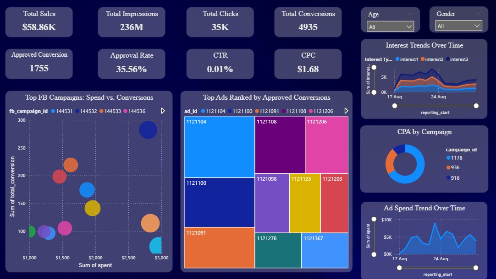

# Facebook Campaign Performance Tracker

## 📊 Overview
This dashboard provides insights into campaign performance metrics such as spend, conversions, and ad engagement.  
It allows filtering by gender, campaign ID, and time period to analyze trends and identify top-performing ads.

## 🗂 Data Source
- Dataset: [Describe the dataset briefly — e.g., "Social media campaign performance data"]
- Columns used:
  - `reporting_start` – Campaign start date
  - `spend` – Total campaign spend
  - `approved_conversion` – Number of approved conversions
  - `ad_id` – Unique ad identifier
  - `fb_campaign_id` – Facebook campaign identifier

## 📈 Dashboard Features
- **Cards** for key metrics (Total Spend, Total Conversions, etc.)
- **Top 10 Ad IDs** by conversions 
- **Spend vs Conversions** comparison by campaign
- **Time Series Chart** showing spend trends
- **Slicers** for gender, campaign ID, and date range

## 🔍 How to Use
1. Open the `.pbix` file in Power BI Desktop.
2. Use the slicers at the top to filter the view.
3. Hover over visuals to see detailed tooltips.

## 📷 Dashboard Preview
*(You can add a screenshot here)*

## 📦 File
- `final_dashboard.pbix` – The Power BI dashboard file

## 📝 Author
- **Mohammed Huzaif Moualana**

